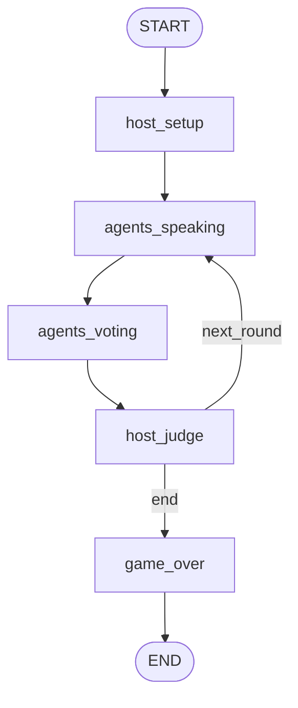

## Workflow Graph

## 流程说明

| 节点 | 职责 |
|------|------|
| `host_setup` | 游戏初始化，分配角色和词语 |
| `agents_speaking` | 收集所有存活玩家的发言 |
| `agents_voting` | 收集所有存活玩家的投票 |
| `host_judge` | 计算投票结果，淘汰玩家，检查胜利条件，决定继续或结束 |
| `game_over` | 游戏结束，宣布获胜方 |

## 关键循环

- **回合循环**：`host_judge → agents_speaking`（多轮游戏循环，直到产生胜者）

## 条件路由

- `continue_next_round(state)`: 根据 `winner` 存在性决定游戏是否继续
  - `"next_round"` → 回到 `agents_speaking` 开始下一轮
  - `"end"` → 进入 `game_over` 结束游戏
